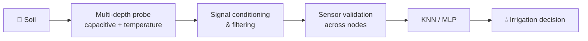

<!-- ===== HEADER ===== -->

  

  
  
  
  

---

## 👋 About me

I'm **Ahmed**, an Embedded Systems & Electronics Engineer. I build systems where the **physical world meets software**: custom sensors, low-level firmware, signal processing, and AI that turns raw measurements into decisions.

<table>
  <tr>
    <td>🎓 <b>Education</b></td>
    <td>M.Sc. Embedded Systems Engineering, Université Ibn Khaldoun de Tiaret (2024–2025), <b>ranked 1st in Electronics</b></td>
  </tr>
  <tr>
    <td>💼 <b>Now</b></td>
    <td>Industrial automation (PLC / HMI / SCADA) at Tassyir Digital</td>
  </tr>
  <tr>
    <td>🔭 <b>Focus</b></td>
    <td>Environmental sensing · Edge AI · Precision agriculture</td>
  </tr>
  <tr>
    <td>🌍 <b>Languages</b></td>
    <td>Arabic (native) · English · French</td>
  </tr>
</table>

---

## 🌱 Featured Project

### Real-Time Monitoring and Autonomous Smart Irrigation Based on Soil Moisture Profiling

Irrigation shouldn't depend on a single surface value. This project builds a **vertical soil profile** so decisions reflect the **root zone**.

- 🧪 **Custom multi-depth probe**: helical capacitive moisture electrodes with temperature sensing at several levels
- 📉 **Signal conditioning** (TLV272-based stage) and temperature-assisted interpretation
- 🌍 **Experiments on black, red and brown soils** (~2 months) using **KNN** and **MLP**
- 🕸️ **Local intelligent network**: nodes cross-check neighbors to flag abnormal or failed sensors, with no cloud dependency
- 🗺️ **Roadmap**: PIC → STM32 nodes with nRF links → Raspberry Pi hub with dashboard, AI and camera

> ⚠️ **Status:** laboratory proof-of-concept (TRL-4 style). Roadmap items are planned, not deployed.

---

## 🛠️ Other Projects

| Project | What it does | Stack |
|---|---|---|
| 🤖 **Autonomous Robot with AI Vision** | Object detection and navigation | ESP32 · TensorFlow Lite · OpenCV |
| 💡 **Smart Lighting Control** | AI-based lighting for energy optimization | ESP32 · TensorFlow · MQTT · Cloud API |
| 🔌 **Multi-Layer PCB Design** | Signal-integrity and thermal optimization | Altium Designer |
| 🎮 **Maze Garden** | Interactive web game platform | HTML · CSS · JavaScript |

---

## ⚡ Tech Stack

<table>
  <tr>
    <td valign="top" width="25%">
      <b>Embedded</b>  
      C · C++ · Assembly 
      PIC16F/18F · dsPIC33 
      STM32 · ESP32 
      Arduino · Raspberry Pi 
      FreeRTOS · Embedded Linux
    </td>
    <td valign="top" width="25%">
      <b>Hardware</b>  
      Altium Designer · KiCad 
      VHDL · Verilog · FPGA 
      Proteus · Ngspice 
      Analog conditioning 
      Multi-layer PCB
    </td>
    <td valign="top" width="25%">
      <b>AI & Vision</b>  
      Python · MATLAB 
      KNN · MLP 
      TensorFlow Lite 
      OpenCV 
      Edge AI
    </td>
    <td valign="top" width="25%">
      <b>Industrial & Web</b>  
      PLC · HMI · SCADA 
      MQTT 
      JavaScript · HTML · CSS 
      Java 
      Git · Docker
    </td>
  </tr>
</table>

  
  
  
  
  
  
  
  
  
  
  
  
  
  

---

## 🏆 Competitions & Certificates

<b>Competitions</b>

 

- Chipathon 2026, Track B: Circuits for Sensors (OpenLane · Sky130 · Magic · Ngspice)
- NOVATECH Hackathon (Finalist)
- Huawei ICT Competition (Regional Stage)
- Drone Innovation Challenge · INV-TECH Hackathon · Drought Prediction Hackathon (Sudan)

<b>Certificates</b>

 

- Advanced Embedded Systems Design
- Computer Vision for Robotics
- IoT System Architecture
- RTOS Programming (FreeRTOS)
- Advanced PCB Design

---

## 🤝 Let's build something

I'm open to collaboration on embedded systems, environmental sensing, Edge AI and smart agriculture.

<!-- Add when ready:

-->

