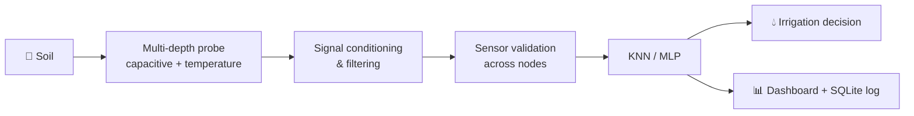

  

  

  
  
  
  

  
  
  
  

---

## 👋 About me

I'm **Ahmed**, an Embedded Systems & Electronics Engineer. I build systems where the **physical world meets software**: custom sensors, low-level firmware, signal processing, AI that turns raw measurements into decisions, and the web interfaces and databases that make that data usable.

<table>
  <tr>
    <td>🎓 <b>Education</b></td>
    <td>M.Sc. Embedded Systems Engineering, Université Ibn Khaldoun de Tiaret (2024–2025), <b>ranked 1st in Electronics</b></td>
  </tr>
  <tr>
    <td>💼 <b>Now</b></td>
    <td>Industrial automation (PLC / HMI / SCADA) at Tassyir Digital</td>
  </tr>
  <tr>
    <td>🧠 <b>Previously</b></td>
    <td>AI internship at SIINE Academy (AI projects, software development, web solutions)</td>
  </tr>
  <tr>
    <td>🔭 <b>Focus</b></td>
    <td>Environmental sensing · Edge AI · Precision agriculture</td>
  </tr>
  <tr>
    <td>🌍 <b>Languages</b></td>
    <td>Arabic (native) · English · French</td>
  </tr>
</table>

> **Electronics → Sensors → Firmware → Acquisition → Signal Processing → AI/ML → Decision Support → Dashboard → Automation**

---

## 🌱 Featured Project

### Real-Time Monitoring and Autonomous Smart Irrigation Based on Soil Moisture Profiling

Irrigation shouldn't depend on a single surface value. This project builds a **vertical soil profile** so decisions reflect the **root zone**.

- 🧪 **Custom multi-depth probe**: helical capacitive moisture electrodes with temperature sensing at several levels
- 📉 **Signal conditioning** (TLV272-based stage) and temperature-assisted interpretation
- 🌍 **Experiments on black, red and brown soils** (~2 months) using **KNN** and **MLP**
- 🕸️ **Local intelligent network**: nodes cross-check neighbors to flag abnormal or failed sensors, with no cloud dependency
- 🗺️ **Roadmap**: PIC → STM32 nodes with nRF links → Raspberry Pi hub with dashboard, AI and camera

> ⚠️ **Status:** laboratory proof-of-concept (TRL-4 style). Roadmap items are planned, not deployed.

---

## 🔌 Hardware Gallery

<table>
  <tr>
    <td align="center"> Board layout, 3D view</td>
    <td align="center"> Microcontroller board, 3D view</td>
  </tr>
</table>

---

## 🛠️ Other Projects

| Project | What it does | Stack | Links |
|---|---|---|---|
| 💡 **Smart Lighting Control System** | AI-based remote lighting control with energy optimization | ESP32 · TensorFlow · WiFi/BLE · MQTT · React Native · Cloud API | [Code](https://github.com/ahmedoukali-pixel/lighting-control) |
| 🤖 **Autonomous Robot with AI Vision** | Object detection and navigation | ESP32 · TensorFlow Lite · OpenCV | [Code](https://github.com/ahmedoukali-pixel/autonomous-robot) |
| 🔌 **Multi-Layer PCB Design** | Signal-integrity and thermal optimization | Altium Designer | See gallery above |
| 🎮 **MAZE GARDEN** | Interactive web platform for gaming and puzzles, responsive UI | HTML5 · CSS3 · JavaScript · GitHub Pages | [Live](https://hostinghosting144-star.github.io/MAZE_GARDEN./) · [Source](https://github.com/hostinghosting144-star/MAZE_GARDEN) |
| 🌐 **Personal Portfolio** | Animated, responsive portfolio site (dark theme, scroll animations, mobile menu) | HTML5 · CSS3 · Vanilla JavaScript | [Source](https://github.com/ahmedoukali-pixel) |

---

## ⚡ Tech Stack

<table>
  <tr>
    <td valign="top" width="33%">
      <b>🔧 Embedded</b>  
      C · C++ · Assembly 
      PIC16F/18F · dsPIC33 
      STM32 · ESP32 
      Arduino · Raspberry Pi 
      FreeRTOS · Embedded Linux
    </td>
    <td valign="top" width="33%">
      <b>🔌 Hardware</b>  
      Altium Designer · KiCad 
      VHDL · Verilog · FPGA 
      Proteus · Ngspice 
      Analog conditioning 
      Multi-layer PCB · DSP
    </td>
    <td valign="top" width="33%">
      <b>🧠 AI & Vision</b>  
      KNN · MLP · Neural Networks 
      TensorFlow · TensorFlow Lite 
      OpenCV · Computer Vision 
      Edge AI · On-device inference 
      Python · MATLAB
    </td>
  </tr>
  <tr>
    <td valign="top">
      <b>🎨 Front-End</b>  
      HTML5 · CSS3 
      JavaScript (vanilla) 
      Responsive design 
      CSS animations · Intersection Observer 
      React Native (mobile app)
    </td>
    <td valign="top">
      <b>🗄️ Data & Backend</b>  
      SQL · SQLite 
      Python services 
      MQTT · Local dashboards 
      Client/server architectures
    </td>
    <td valign="top">
      <b>🏭 Industrial & Tools</b>  
      PLC · HMI · SCADA 
      Git · Docker 
      Java 
      MPLAB X · Keil µVision
    </td>
  </tr>
</table>

  
  
  
  
  
  
  
  
  
  
  
  
  
  
  
  
  
  
  
  

---

## 🏆 Competitions & Certificates

<b>Competitions</b>

 

| Event | Date | Notes |
|---|---|---|
| Chipathon 2026, Track B: Circuits for Sensors | 2026 | OpenLane · Sky130 · Magic · Ngspice |
| NOVATECH Hackathon | Nov 2023 | **Finalist** |
| Drone Innovation Challenge | Sep 2024 | Autonomous drone systems for agriculture and delivery |
| INV-TECH Hackathon | Mar 2025 | 5G and IoT solutions |
| Huawei ICT Competition | Regional stage | |
| Drought Prediction Hackathon | Sudan | |

<b>Certificates</b>

 

- Advanced Embedded Systems Design
- Computer Vision for Robotics
- IoT System Architecture
- RTOS Programming (FreeRTOS)
- Advanced PCB Design

---

## 🤝 Let's build something

I'm open to collaboration on embedded systems, environmental sensing, Edge AI, smart agriculture and technical web platforms.

  
  
  

<i>"Innovating the future, one circuit at a time"</i>

